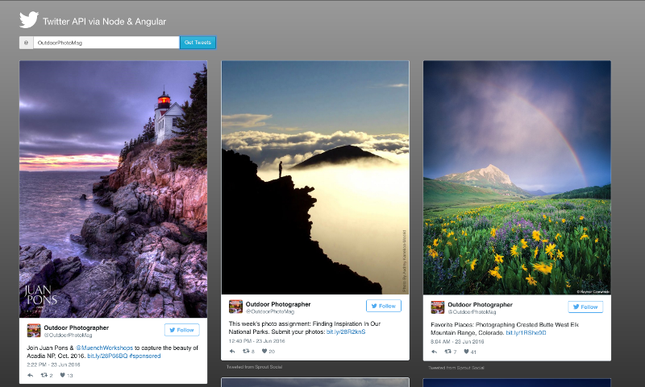

#Rendering Tweets with Angular & Node

##Technologies: Node.js Angular 1 Javascript Bootstrap HTML CSS Twitter Search API

### To get started on your own machine
1. Clone the files from GitHub.
2. Install Node from node.js if you haven't already
3. Run ``nodemon`` - this will start the server at port 8000
4. Open your browser and hit ``localhost:8000`` to view page
5. Type in the twitter handle you want to search and hit enter
6. Scroll to the bottom of the page to **get more tweets** or hit the **Top** button to go back to the top of the page

Published on June 23, 2016.
